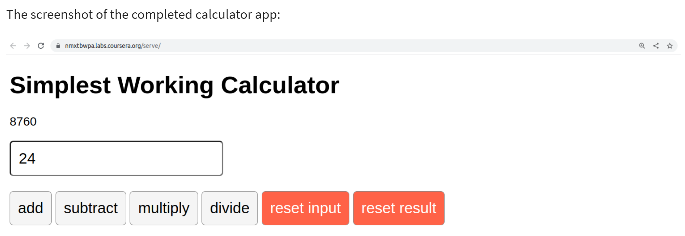
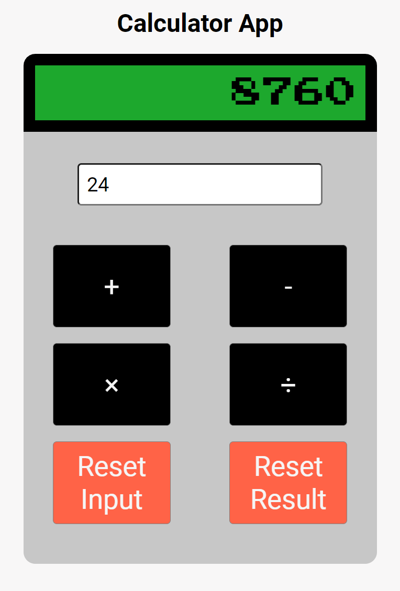

# Calculator App

This was a project I completed for Meta'a Front-End Developer course, and my first ever React app. I was tasked with a creating a simple looking calculator to test my knowledge on that chapter's React concepts.

## Technologies Used:

- React
- Figma
- CSS
- HTML

## Project Overview

In order to pass, the UI/UX wasn't important. All I needed to do was ensure the calculator's logic worked. This required me to understand concepts like both the useState and useRef hooks, as well as how to create a controlled form.

However, after passing, I went back to code custom CSS and transform the calculator into a much better looking app. This was done by utilizing the UX/UI skills I developed in a later chapter of Meta's course that taught Figma. Here are images of before and after.

### **Original Calculator:**

### **Updated Calculator:**

Overall, this was a very fulfilling project as it significantly increased my React skills. From basic concepts such as how a Create React App template looks like, to more advanced skills like using multiple hooks within one onClick event assigned to a button.

Additionally, by transforming the calculator's aesthetic to improve the UX, I also sharped my CSS skills like CSS grid.

## Installation

To run the project locally, follow these steps:

1. Clone the repository (for Git): `git clone https://github.com/acktreptow/react-calculator.git`
2. Navigate to the project directory: `cd react-calculator`
3. Type `npm i` into the command line to ensure all dependencies are installed
4. Type `npm start` into the command line to view it in your preferred browser

## Future Enhancements

I would like to add even more buttons at some point. For example, a decimal point for further functionality.

## Contact

If you have any questions or feedback, please reach out to me at [alex@treptow.dev](mailto:alex@treptow.dev)
